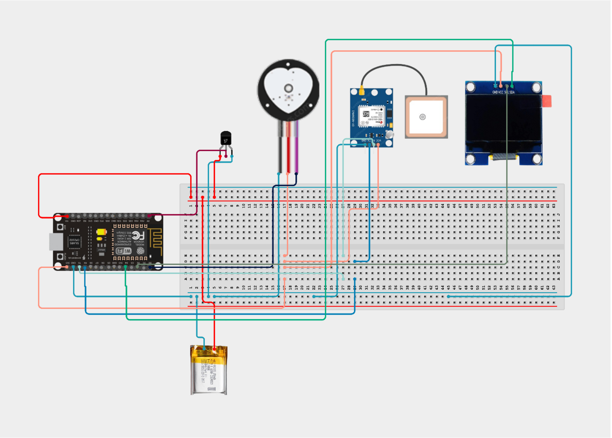

# Military Soldier Health Monitoring System (KENG-CV #007) 🔰

A real-time IoT-based health and safety monitoring system for military soldiers. This wearable device, powered by an ESP32 microcontroller, continuously tracks a soldier’s vital signs — including heart rate, body temperature, GPS location, and glove status — and transmits the data to a centralized Blynk Cloud dashboard for real-time monitoring and safety alerts.

---

## 📌 Project Overview

This system helps track vital signs of soldiers on the field, ensuring real-time health and safety updates to the command center.

**Main Features:**

- 💓 Real-time heart rate monitoring with Pulse Sensor
- 🌡️ Body temperature measurement using LM35
- 📍 GPS-based location tracking (Neo-6M)
- 🧤 Glove detection via IR sensor for safety compliance
- ⬛ OLED display for local data view
- 🖥📊📉 Blynk dashboard for live cloud-based monitoring

---

## 🚀 Getting Started

## ⚙️ Hardware Requirements:
| Component         | Quantity | Purpose                            |
|------------------|----------|------------------------------------|
| ESP32             | 1        | Main controller with WiFi         |
| MAX30100 / Pulse Sensor | 1   | Heart rate sensing                |
| LM35              | 1        | Temperature sensing               |
| Neo-6M GPS        | 1        | Location tracking                 |
| OLED 0.96” I2C    | 1        | Display heart/temp/location       |
| IR Sensor         | 1        | Glove presence detection          |
| 7V LiPo Battery   | 1        | Portable power                    |

### Software Requirements:

- C++ (Arduino IDE)
- Blynk IoT Platform
- C++ (Arduino IDE)
- Required Libraries:
  - `WiFi.h`, `Wire.h`, `BlynkSimpleEsp32.h`
  - `Adafruit_SSD1306`, `Adafruit_GFX`
  - `PulseSensorPlayground`, `TinyGPS++`

---

## 🔌 Circuit Diagram



---

## 🔌 Pin Configuration

| Sensor / Module          | ESP32 Pin | Description                      |
| ------------------------ | --------- | -------------------------------- |
| Pulse Sensor             | GPIO32    | Analog input for BPM             |
| LM35 Temperature Sensor  | GPIO34    | Analog input for temperature     |
| IR Sensor (Glove Detect) | GPIO35    | Analog input for glove detection |
| GPS RX                   | GPIO16    | Receives GPS data                |
| GPS TX                   | GPIO17    | Sends GPS data                   |
| OLED SDA                 | GPIO21    | I2C data line                    |
| OLED SCL                 | GPIO22    | I2C clock line                   |

---

## 🔌 Wiring Guide

For detailed circuit connections and sensor pin configurations, refer to the [Wiring Guide](./Docs/wiring_guide.md).

---

## 🌐 Blynk Dashboard Setup

Refer to [`Docs/Blynk_Configuration.md`](./Docs/Blynk_Configuration.md) for full details on:

- Creating the Blynk template
- Mapping virtual pins
- Adding widgets to the dashboard

---

## 📁 Folder Structure

```
📆Military Soldier Health Monitoring System
🔜 Arduino_Code
🔜 Docs
🔜 Reports
🔜 Images
├── .gitignore
├── LICENSE
└── README.md
```

---

## 📸 Output Dashboard


---

## 🎓 Course Info

This project was developed as part of:

- **Course:** Fundamentals of Computing - IT1140 (Year 1, Semester 1, 2024)
- **Institution:** Sri Lanka Institute of Information Technology
- **Group Code:** P15
- **Team Members:**
   - Kavindu Umayanga Amarakeerthi *(University Record: Amarakeerthi H. K. K. U.)* – Embedded Developer
   - Eranjana Weerasinghe *(University Record: Weerasinghe A. E. K. P.)*
   - Nimna Jayasinha *(University Record: Jayasinha W. M. S. S. N.)*
   - Geenuth Perera *(University Record: Perera W. G. D.)*
   - Vidara Karannagoda *(University Record: Karannagoda K. V. R.)*
   - Chamodika *(University Record: Chamodika J. W. C.)*

---

## 🤝 Contributions

Contributions are welcome! Please fork the repo and submit a pull request for improvements.

---

## 📜 License

This project is licensed under the [MIT License](./LICENSE).

---

## 📞 Contact

For questions or support, please contact:

- Kavindu Umayanga – [[kavinumayanga@gmail.com](mailto\:kavinumayanga@gmail.com)]
- Nimna Jayasinha – [[nimnajayasingha56@gmail.com](mailto\:nimnajayasingha56@gmail.com)]
- Eranjana Weerasinghe - [[eranjanaweerasinghe@gmail.com](mailto\:eranjanaweerasinghe@gmail.com)]

